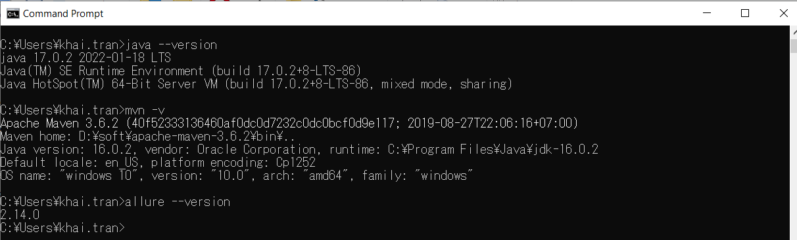

# Project1 in Java

This is a project for the assignment from email: "Aspire India || QA Development Challenge"

## Running this example
The tests are run on both Chrome and Firefox

### Prerequisites

This example was built and verify on Window 10. It requires the following softwares to run.
  * [Java 1.7](https://www.oracle.com/java/technologies/downloads/#jdk17-windows) or above
  * [Maven 3.6.2](https://maven.apache.org/install.html) or above
  * [Allure 2.14](https://docs.qameta.io/allure/)
  * Chrome 98
  * Firefox 97
  

### Setting up the System Under Test (SUT)

  * The SUT should now be available at [https://aspireapp.odoo.com](https://aspireapp.odoo.com)

### Run specs

  * Checkout the source code at https://github.com/khaitran2019/Exercise1.git on "main" branch.
  * If you already have Maven installed, you can execute batch file "run.bat" under "project1" folder
  * The batch file will run the xml suite  "run_tests\chrome_firefox_window.xml"
  * XML suite file support 2 parameters:
     - flatform: It's a setting to specify test browser. Values: Chrome | Firefox  
	 - capture_screenshots: It's a setting to capture screenshot of SUT and attach to allure report. Values: True | False

### Test result
- The allure test report is stored in folder "allure-results"

### Project configuration

- All the configurationa and test data is defined in Constants.java

